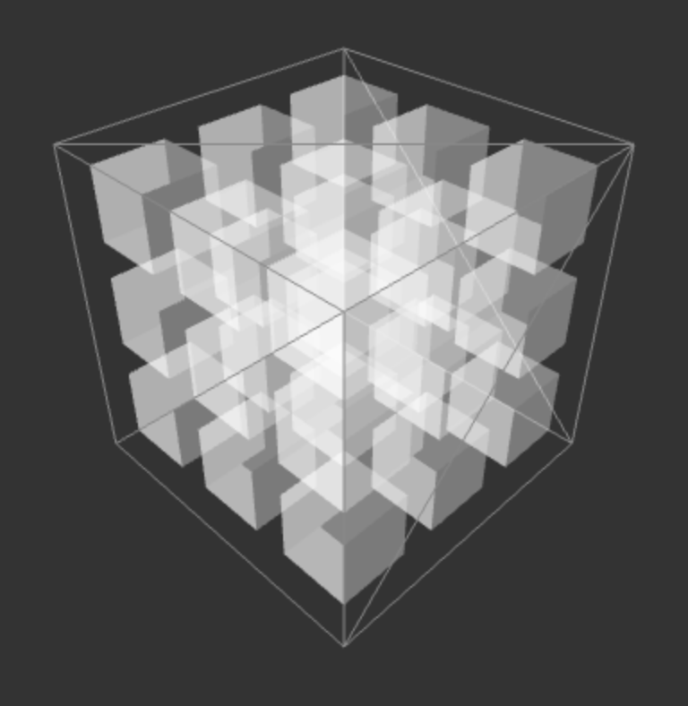

# 3D Tic-Tac-Toe



## Overview

3D Tic-Tac-Toe takes the traditional 2D game to the next level by adding a third dimension. Instead of a single 3×3 grid, players compete on a 3×3×3 cube consisting of 27 positions. The objective remains the same: be the first to create a line of your symbols, but now lines can form in three dimensions, creating many more winning possibilities.

## Features

- **Interactive 3D Game Board**: Fully rotatable and interactive 3D cube
- **Two Player Mode**: Play against a friend locally
- **AI Opponent**: Challenge our intelligent computer opponent with adjustable difficulty
- **Game Statistics**: Track your wins, losses, and draws
- **Tutorial Mode**: Learn the game with an interactive tutorial
- **Responsive Design**: Play on desktop or mobile devices

## How to Play

1. **Starting the Game**: The first player places an 'X' in any empty position on the 3D grid
2. **Taking Turns**: Players alternate placing their symbol ('X' or 'O') in empty positions
3. **Winning the Game**: The first player to form a line of three of their symbols wins
   - Lines can be formed horizontally, vertically, or diagonally in any plane
   - There are 49 possible winning lines (9 horizontal, 9 vertical, 9 depth, 4 main diagonals, and 18 mixed diagonals)
4. **Draw**: If all positions are filled without a winner, the game ends in a draw

## Strategy Tips

- **Control the Center**: The center position is part of 13 possible winning lines
- **Watch for 3D Diagonals**: The most overlooked winning opportunities are diagonals that span all three dimensions
- **Block Opponent's Lines**: Pay attention to your opponent's potential winning moves
- **Plan Multiple Threats**: Create situations where you have multiple winning opportunities

## Installation

1. Clone the repository.
```
git clone https://github.com/robertcdawson/3D-Tic-Tac-Toe.git
```

2. Navigate to the project directory.
```
cd 3d-tic-tac-toe
```

3. Open the game in a browser and play!

## Technologies Used

- Frontend: HTML, CSS, and plain-ol' vanilla JavaScript
- 3D Rendering: Three.js

## Contributing

Contributions are welcome! Please feel free to submit a Pull Request.

1. Fork the repository
2. Create your feature branch (`git checkout -b feature/amazing-feature`)
3. Commit your changes (`git commit -m 'Add some amazing feature'`)
4. Push to the branch (`git push origin feature/amazing-feature`)
5. Open a Pull Request

## License

This project is licensed under the MIT License - see the [LICENSE](LICENSE) file for details.

## Acknowledgments

- Inspired by the classic Tic-Tac-Toe game
- Thanks to all contributors and testers 